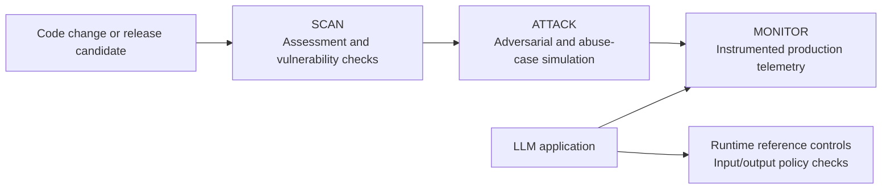

# 🛡️ LLM Strata — AI/LLM Security & Safety Testing Framework

[](https://www.python.org/)
[](LICENSE)
[](.gitlab-ci.yml)
[](https://owasp.org/www-project-top-10-for-large-language-model-applications/)
[](#-security-and-safety-capability-map)

[](https://github.com/VenkateshDoijode/LLM-Strata/stargazers)
[](https://github.com/VenkateshDoijode/LLM-Strata/network/members)
[](https://github.com/VenkateshDoijode/LLM-Strata/issues)
[](https://github.com/VenkateshDoijode/LLM-Strata/commits)
[](https://github.com/VenkateshDoijode/LLM-Strata/pulls)

🔗 **Repository:** [github.com/VenkateshDoijode/LLM-Strata](https://github.com/VenkateshDoijode/LLM-Strata)

## 🎯 Objective

LLMs are powerful — but they can be manipulated, abused, and exploited in ways traditional software cannot.
**LLM Strata** is a Python framework for testing and monitoring LLM-powered applications across their lifecycle. It provides configurable coverage; it does not guarantee detection of every attack or replace production authorization controls:

- 🔍 **Before deployment** — find vulnerabilities, safety gaps, and adversarial weaknesses
- 🚧 **At runtime** — demonstrate input/output scanning and policy controls that applications can integrate in real-time
- 📈 **In production** — continuously monitor for safety drift and suspicious behaviour

This framework provides configurable coverage across documented LLM security and safety threat categories using 14 modules. Some modules require provider-specific credentials, external services, or optional dependencies; none guarantees complete detection.

## 💡 Why This Project is Useful

### 👩‍💻 For Developers

- Assess selected **OWASP LLM Top 10** threat categories before release
- Identify jailbreak, prompt-injection, and harmful-output risks before deployment
- Run the configured security pipeline through one orchestrator command: `python run_security.py`

### 🔐 For Security Teams

- Run structured automated and human red-team exercises with logged, scored results
- Map instrumented tests to documented **OWASP LLM Top 10** threat categories
- Replace ad-hoc testing with a repeatable workflow and reviewable evidence

### 🧠 For AI/ML Teams

- Evaluate configured RAG safety cases, including context poisoning and grounding risks
- Score selected safety metrics and save structured JSON reports
- Connect supported providers through profiles and module configuration

### 🏭 For Production Systems

- Use LLM Guard as a reference for local input/output scanning and control benchmarking
- Send instrumented requests and safety scores to LangFuse
- Review safety trends over time to identify potential drift

---

## ⚙️ Capabilities

| Capability | Purpose | Typical use |
|---|---|---|
| 🧪 Pre-deployment assessment | Identify prompt injection, jailbreak, leakage, misuse, and safety weaknesses | Pull requests, release candidates, scheduled assessments |
| ⚔️ Adversarial attack simulation | Exercise encoded, multilingual, in-context, agentic, backdoor, and RAG attack paths | Security validation and red-team exercises |
| 🚧 Runtime reference controls | Demonstrate local input/output scanning and policy checks for application integration | Control benchmarking and defense-in-depth validation |
| 📡 Production monitoring | Capture traces and safety scores for instrumented requests | Drift detection and operational review |
| 🧾 Evidence and reporting | Persist structured JSON results and CI artifacts | Triage, audit evidence, and remediation tracking |

## 🗺️ Security and Safety Capability Map

LLM Strata is composed of 14 independent security and safety layers. Each layer has its own runner, configuration, outputs, and direct command, so it can be executed independently or as part of the full pipeline. The layers share provider, profile, and reporting utilities while remaining independently configurable.

The framework combines pre-deployment testing, runtime scanning, agent/RAG security tests, human review, and production monitoring. Coverage is configurable and should be interpreted as evidence from the selected test corpus—not as a guarantee of complete protection.

- 🧪 **Pre-deployment:** [Garak](garak/garak.md), [DeepEval](deepeval/deepeval.md), [RAGAS](ragas/ragas.md), [PyRIT](pyrit/pyrit.md)
- 📡 **Runtime and monitoring:** [LLM Guard](llm_guard/llm-guard.md), [LangFuse](langfuse/langfuse.md)
- 🕵️ **Human and advanced attacks:** [Human Red Team](human_redteam/human-redteam.md), [Encoded Attacks](encoded_attacks/encoded-attacks.md), [In-Context Attacks](in_context_attacks/in-context-attacks.md), [Multilingual Attacks](multilingual/multilingual.md), [Backdoor Triggers](backdoor/backdoor.md)
- 🤖 **Agent and RAG security:** [Tool Injection](tool_inject/tool-injection.md), [RAG Security](rag_security/rag-security.md), [Agent Security](agent_security/agent-security.md)

> 👆 Click any module name above to open its dedicated guide and learn more about its purpose, configuration, usage, outputs, and coverage.

## 🏗️ Architecture

The framework is organized into three operational stages:



Each runner is independently configurable. Reports should be interpreted as evidence from the selected test corpus, not as proof of complete protection.

## 🚀 Quick start

### 📋 Prerequisites

- 🐍 Python 3.10-3.14 (Python 3.14 is supported; Python 3.10-3.12 remains the most conservative compatibility range)
- 🔑 Credentials for the selected model provider, where required
- 📡 LangFuse credentials only when production monitoring is enabled
- 🌐 Network access to the target model or a reachable private/local endpoint

### 📥 Install

Clone the repository:

```bash
git clone https://github.com/VenkateshDoijode/LLM-Strata.git
cd LLM-Strata
```

Then run the setup:

```bash
python setup.py
```

The setup process creates the main virtual environment, installs dependencies, provisions the isolated Garak environment, and creates report directories.

### 🔑 Configure credentials

Create a local environment file from the provided template, then keep only the variables required by your selected profile.

Windows PowerShell:

```powershell
Copy-Item .env.example .env
```

Linux/macOS:

```bash
cp .env.example .env
```

Configure the applicable provider variables in `.env` or in the operating-system environment:

| Provider/profile | Required variables |
|---|---|
| OpenAI (`production`, `cost_optimized`, `redteam`) | `OPENAI_API_KEY` |
| Azure OpenAI (`azure`) | `AZURE_OPENAI_API_KEY`, `AZURE_OPENAI_ENDPOINT` |
| Gemini (`gemini`) | `GEMINI_API_KEY` |
| Hugging Face (`huggingface`) | `HF_TOKEN` |
| Anthropic (`anthropic`) | `ANTHROPIC_API_KEY` |
| AWS Bedrock (`bedrock`) | `AWS_ACCESS_KEY_ID`, `AWS_SECRET_ACCESS_KEY`, `AWS_REGION_NAME` |
| Ollama (`local`) | No cloud key by default; start the Ollama service |
| Private compatible endpoint (`private_compatible`) | `OPENAI_COMPATIBLE_BASE_URL` and an optional `OPENAI_COMPATIBLE_API_KEY` |

> ✅ **Select any one provider of your choice — you don't need to set up all of them.** Configure only the variables required by the provider/profile you plan to use.

For production monitoring, also set `LANGFUSE_PUBLIC_KEY` and `LANGFUSE_SECRET_KEY`. Operating-system variables take precedence over `.env` values. Never commit `.env`, API keys, provider endpoints containing credentials, or generated reports. See [Providers and Secrets](docs/providers-and-secrets.md) for the full provider matrix and precedence rules.

### 🎛️ Select a model profile

Set `active_profile` in `profiles.yaml`, or override it for one process:

```powershell
$env:ACTIVE_PROFILE = "private_compatible"
python run_security.py --dry-run
```

Available profiles include OpenAI, Azure, Ollama, Gemini, Hugging Face, Anthropic through LiteLLM, AWS Bedrock through LiteLLM, and private OpenAI-compatible endpoints. See [`profiles.yaml`](profiles.yaml) for the current profile definitions.

### ✅ Validate and run

Start with a non-networked orchestration check:

```bash
python run_security.py --dry-run
```

Run the configured pipeline only after reviewing credentials, data handling, and cost:

```bash
python run_security.py
```

Run the focused unit tests:

```bash
python -m unittest discover -s agent_security/tests -v
```

### 🔌 Supported Providers

The current provider adapters are:

- ☁️ OpenAI
- 🔷 Azure OpenAI
- 🦙 Ollama
- 🔵 Google Gemini
- 🤗 Hugging Face Inference API
- 🧩 Anthropic through LiteLLM
- 🟠 AWS Bedrock through LiteLLM
- 🔒 Private and on-premises OpenAI-compatible endpoints

#### 🌍 Supported Deployment Contexts

The framework can assess these deployment contexts when the target is reachable through a supported interface:

- ☁️ Cloud LLM
- 🏢 Private Cloud LLM
- 💻 Local/On-Prem LLM
- 📱 Edge LLM
- 🔀 Hybrid LLM
- 🔐 Air-Gapped LLM
- 📦 Containerized LLM
- 🌐 Multi-Cloud LLM
- 🧱 Embedded/Application LLM

> 💡 The framework supports OpenAI-compatible endpoints and selected LiteLLM-backed providers. Additional LiteLLM providers can be integrated through `client_factory.py` and `profiles.yaml`. See [Providers and Secrets](docs/providers-and-secrets.md).

## 🔄 CI/CD

The GitLab pipeline is organized into three stages:

| Stage | Purpose | Examples |
|---|---|---|
| 🔍 `scan` | Core security and safety assessment | Vulnerability scanning, safety evaluation, agentic red teaming |
| ⚔️ `attack` | Advanced adversarial simulation | Encoding, multilingual, in-context, tool injection, backdoor, RAG security |
| 📡 `monitor` | Instrumented monitoring | LangFuse traces and safety scores |

Run the CI-equivalent dry run locally:

```bash
python run_security.py --dry-run
python run_security.py --ci --skip-langfuse
```

The pipeline stores reports under `results/` as CI artifacts. Review reports rather than relying only on job status; advisory attack jobs may complete successfully while reporting unsafe behavior.

---

## 📚 Documentation

| Guide | Description |
|---|---|
| 🏗️ [Architecture](docs/architecture.md) | Pipeline phases, trust boundaries, and data flow |
| 🎯 [Threat model](docs/threat-model.md) | Assets, actors, assumptions, and coverage boundaries |
| 🔑 [Providers and secrets](docs/providers-and-secrets.md) | Profiles, credentials, endpoints, and provider integration |
| 🔄 [CI/CD operations](docs/ci-cd.md) | Stages, variables, artifacts, and release guidance |
| 🧾 [Results and triage](docs/results-and-triage.md) | Outcome interpretation and remediation workflow |
| 🏭 [Production integration](docs/production-integration.md) | Runtime enforcement and monitoring integration |

## 📁 Project structure

```text
LLM-Strata/
├── run_security.py          # Main pipeline runner
├── profiles.yaml            # Model profile selection
├── profile_loader.py        # Profile loading
├── env_loader.py            # Credential and .env loading
├── client_factory.py        # OpenAI-compatible client creation
├── ragas_config.yaml        # RAGAS configuration
├── requirements.txt         # Python dependencies
├── setup.py                 # Package setup
├── gitlab-ci.yml            # GitLab CI pipeline definition
├── garak/                   # Layer 1
├── deepeval/                # Layer 2
├── ragas/                   # Layer 3
├── pyrit/                   # Layer 4
├── llm_guard/               # Layer 5
├── langfuse/                # Layer 6
├── human_redteam/           # Layer 7
├── encoded_attacks/         # Layer 8
├── many_shot/               # Layer 9
├── multilingual/            # Layer 10
├── tool_inject/             # Layer 11
├── backdoor/                # Layer 12
├── rag_security/            # Layer 13
├── agent_security/          # Layer 14
├── docs/                    # Threat model, architecture, CI/CD, triage, integration
└── results/                 # Generated reports 
```

---

## 🤝 Contributing

Contributions are welcome! 🎉 Fork the repository, make your change, and open a pull request with a short description of what you changed and why.

- 🐛 Found a bug or have an idea? [Open an issue](https://github.com/VenkateshDoijode/LLM-Strata/issues)
- 🔧 Ready to contribute? [Submit a pull request](https://github.com/VenkateshDoijode/LLM-Strata/pulls)
- ⭐ Like the project? [Give it a star](https://github.com/VenkateshDoijode/LLM-Strata) to help others find it

---

## 📄 License

LLM Strata is open source. See the `LICENSE` file for the [license terms](LICENSE).

---

## 👤 Author

Created and maintained by [Venkateshwara Doijode](https://github.com/VenkateshDoijode).
